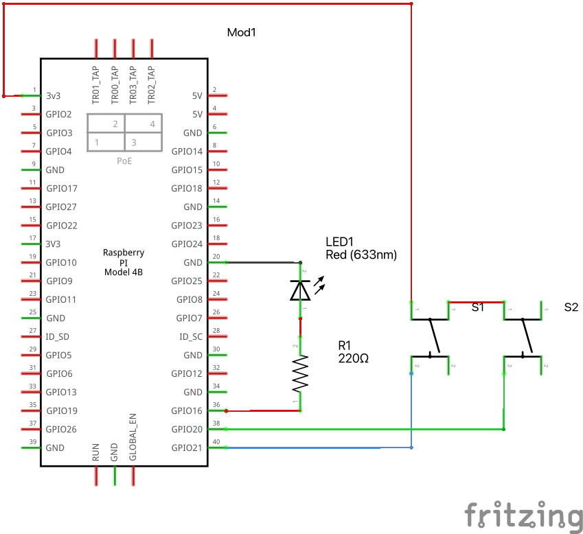
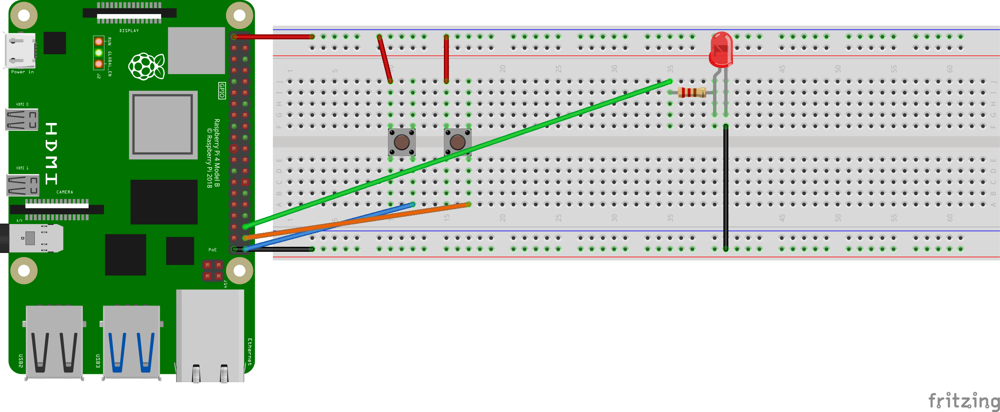

# Lesson 9 Homework Solution

Lesson video:
https://www.youtube.com/watch?v=yJdN6LmGqvc&ab_channel=PaulMcWhorter

Solution video:
https://www.youtube.com/watch?v=tXMvjRG49Nk&ab_channel=HankEhly

## Schematic

## Breadboard

